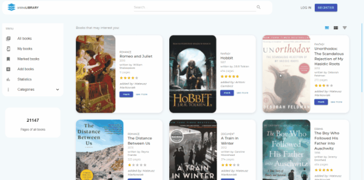

 
 

# Online Library

A college project which allows users to share their opinions about the books they read.

#### The application alows user to:

- browse books
- filter books by category, pages, year, name
- share your books review
- rate and comment the books
- like/dislike comment of book
- browse best books, by most popular, and best rate
- mark books to read later
- delete books which you added
- watch statistics of all books
- watch details of each users

## Demo

 

Here is a working live demo : https://isr-project-kurpiel.herokuapp.com/

## Technologies

Full-stack application utilising a MERN stack.

#### FRONT-END APP

- SPA done in React & Redux
- implements Material-UI
- sends API requests to server

#### BACK-END SERVER

- done in NodeJS with MongoDB
- handles all the API requests
- serves front-end web app
- implements Json Web Tokens for authentication

## Getting Started

1. Run `npm install`
2. Go to client directory `cd client`
3. Run `npm install`
4. Go to parent directory and run npm run dev
5. Open http://localhost:3000 to view it in the browser.

The page will automatically reload if you make changes to the code.
You will see the build errors and lint warnings in the console.
